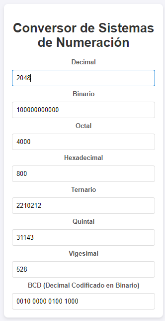

# Conversor de Sistemas de Numeración

Este proyecto es una página web sencilla y visualmente agradable para realizar conversiones entre varios sistemas de numeración, tales como decimal, binario, octal, hexadecimal, y más. La página permite ingresar un número en cualquiera de estos sistemas y ver las conversiones automáticas en los otros sistemas soportados.

## Tecnologías Utilizadas

- **HTML5**: Estructura de la página web.
- **CSS3**: Diseño y estilo de la interfaz de usuario.
- **JavaScript**: Lógica para realizar las conversiones entre los diferentes sistemas de numeración.

## Características

- **Conversión Automática**: Ingresa un valor en un sistema y el sitio web calcula automáticamente su equivalente en los demás sistemas.
- **Soporta los siguientes sistemas**:
  - Decimal (Base 10)
  - Binario (Base 2)
  - Octal (Base 8)
  - Hexadecimal (Base 16)
  - Ternario (Base 3)
  - Quintal (Base 5)
  - Vigesimal (Base 20)
  - BCD (Decimal Codificado en Binario)

## Estructura del Proyecto

```txt
📁 conversor-numeracion/
├── 📄 index.html      # Archivo principal de la interfaz de usuario
├── 📄 styles.css      # Archivo de estilos para un diseño limpio y agradable
└── 📄 script.js       # Lógica JavaScript para las conversiones entre sistemas
```

## Instrucciones para Ejecutar

1. **Descarga o clona el repositorio**:

   ```bash
   git clone https://github.com/usuario/conversor-numeracion.git
   ```

2. **Abre el archivo `index.html` en tu navegador**:
   - Puedes abrir directamente el archivo haciendo doble clic sobre él, o
   - Arrastrar el archivo `index.html` a una pestaña nueva de tu navegador.

## Cómo Usar

1. Ingresa un valor en cualquiera de los campos de los sistemas de numeración (por ejemplo, en Decimal).
2. Automáticamente, el sistema calculará los valores equivalentes en todos los demás sistemas.
3. Para borrar todos los campos, simplemente limpia el campo que ingresaste.

## Ejemplos de Conversión

- **Decimal a Binario**: 10 en decimal es 1010 en binario.
- **Octal a Decimal**: 17 en octal es 15 en decimal.
- **BCD (Binary Coded Decimal)**: 45 en decimal se convierte en `0100 0101` en BCD.

## Capturas de Pantalla



## Contribuciones

¡Las contribuciones son bienvenidas! Si deseas mejorar o agregar funcionalidades, abre un **pull request** o una **issue** en este repositorio.

## Licencia

Este proyecto está bajo la licencia MIT. Consulta el archivo [LICENSE](LICENSE) para más detalles.
